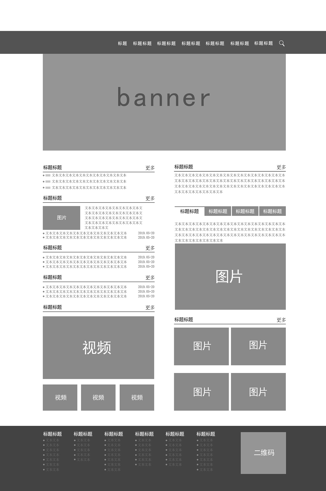

# 简单原型图制作

[Figma file](https://www.figma.com/file/t0kwRTtPhPdPSOyK5xyuaN/Untitled?type=design&node-id=0%3A1&mode=design&t=Hfrywgb5VgcEOdPs-1)

设计很菜，不会画，现学现卖

```
这是一个简单的热身。

在本试题中，你需要使用Figma制作出下面网页链接的低保真原型图，让负责前端开发的同学能够按照原型图进行开发。您只需要尽可能进行还原，并注意要便于前端同学的工作。

链接：https://www.qsc.zju.edu.cn/

形式可以参考这张低保真图：



## 可能需要的学习资料

如果你对figma了解甚少，我们有[figma中文用户手册](https://figmachina.com/) 和[figma中文社区](https://www.figma.cool/)
```